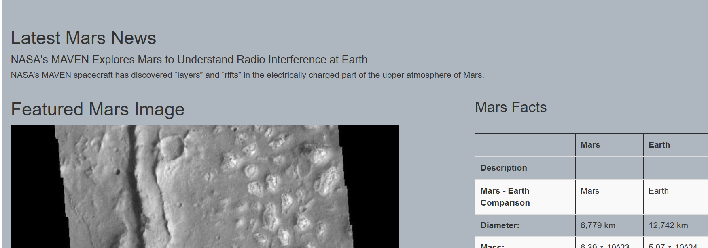
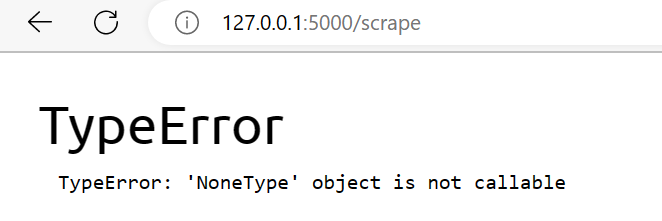
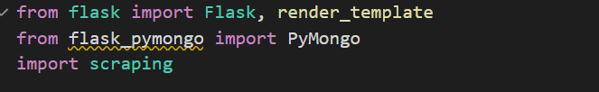
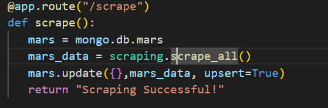

# Mission-to-Mars

## Selected topic
The objective is to gather NASA information into one location, everything polished, and show it off to others getting using Web scraping.

## Reason they selected the topic
Robin, a junior scientist, feels passionate about NASA things, she plans to build web applications that will scrape new data every time she told it with a click of a button.
She is interested in working one day at NASA, so she decided to search much information about the Mission to Mars and she wanted to show everything in one page to astrophile.

## Tecnologies and tools
* Chrome Developer Tools
* Beautiful Soup
* Splinter
* MongoDB
* Flask

## Description of the source of data
Selected some articles and images of NASA web pages to collect the information.
* Link 1: https://redplanetscience.com/
* Link 2: https://spaceimages-mars.com/

## Results 

First, using the HTML Icon is possible to access the webpage, at the top of this webpage is possible to visualize a banner that says Mission to Mars, there was the bottom of Scrape new data because we were using live data is possible to update the information and images according to the data in the web pages that we are using as a source data.

Second, there was a subtitle and a paragraph, then there was another subtitle with an image, and next to the image there was another subtitle with a table describing some information about the earth and mars, comparing some criteria about these two planets.

Finally, there was an error when I clicked on the bottom Scrape news Data, the system shows an error that says: TypeError: 'NoneType' object is not callable, as in the following image.

This error is related to mongo, so I show here the code that is linked with this error, I tried to fix, delete MongoDB and install it again, but the problem still is the same.

## Summarize

This project was very interesting because Web Scraping using HTML, flask, splinter, and beautiful Soul is a good way to have the web page update just with a click, actually we can add more buttons and use different routes to show more information.
Is necessary to fix this error and then it could be a bigger project adding different information about mars and other planets, or the moon, also a good way to create a web page about something else, another interesting theme.
